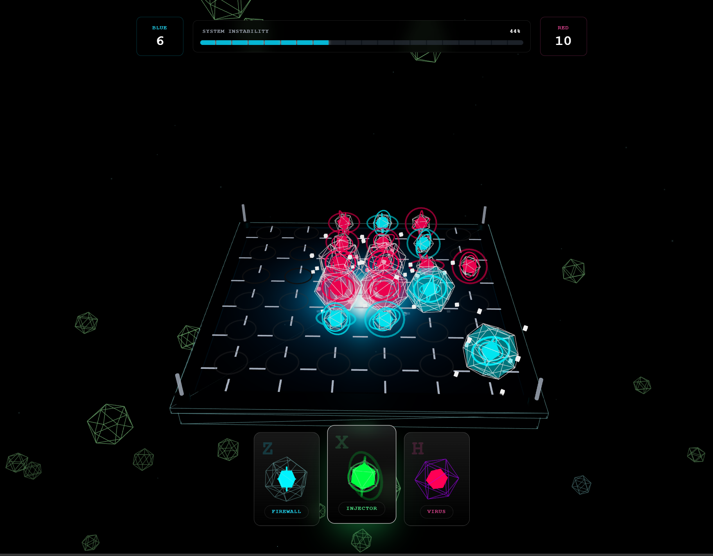
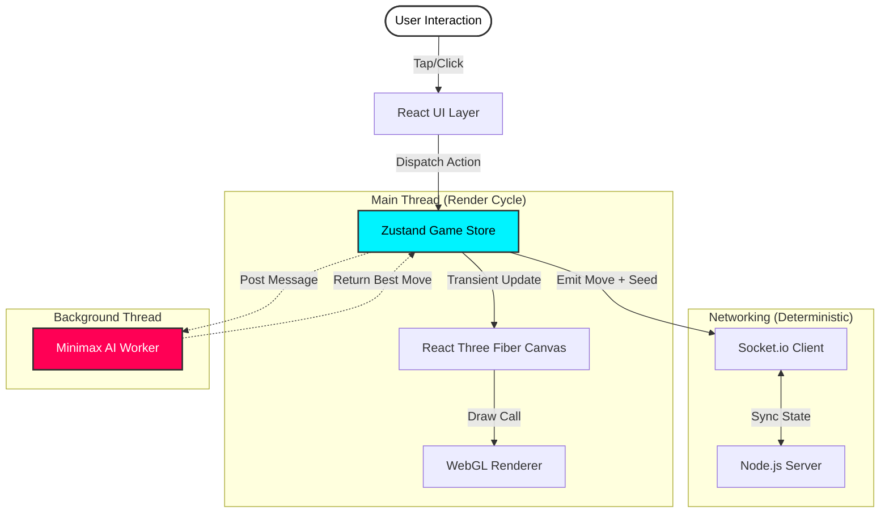

<div align="center">

<!-- PROJECT BANNER: Cyberpunk Gradient to match the game's Neon Blue/Red aesthetic -->


<div align="center">

</div>

<!-- TYPING SVG: Dynamic value propositions -->
<a href="https://quantum-breach.vercel.app/">

  
</a>

<!-- BADGES: High-level status and tech stack -->
<div align="center">
  <a href="https://quantum-breach.vercel.app/">
    
  </a>
  <a href="https://github.com/amir-hossein-khodaei/quantum-breach-webxr/blob/main/LICENSE">
    
  </a>
  
  
</div>

<br />

<!-- ACTION BUTTONS -->
<a href="https://quantum-breach.vercel.app/">
  
</a>
&nbsp;
<a href="#-getting-started">
  
</a>

<p align="center">
  <b>A turn-based tactical breach into the quantum realm.</b><br />
  Featuring rigorous AI, augmented reality, and zero-latency multiplayer state synchronization.
</p>

</div>

---

## 📑 Table of Contents

<details>
<summary><strong>Expand to view full navigation</strong></summary>

- [About The Project](#-about-the-project)
  - [The Problem & Solution](#the-problem--solution)
  - [Technical Architecture](#technical-architecture)
  - [Built With](#built-with)
- [Demo & Visuals](#-demo--visuals)
- [Getting Started](#-getting-started)
  - [Prerequisites](#prerequisites)
  - [Installation](#installation)
- [Usage](#-usage)
  - [Game Rules](#game-rules)
  - [AR / WebXR Mode](#ar--webxr-mode)
- [Engineering Deep Dive](#-engineering-deep-dive)
  - [Minimax AI Implementation](#minimax-ai-implementation)
  - [Deterministic Networking](#deterministic-networking)
- [Roadmap](#-roadmap)
- [Contributing](#-contributing)
- [License](#-license)
- [Contact](#-contact)

</details>

---

## ⚛️ About The Project

**Quantum Breach** is not just a game; it is a technical showcase of what the modern web is capable of. 

In an era where "web games" often imply 2D sprites or heavy engine exports (Unity/Unreal), **Quantum Breach** runs natively on the DOM and WebGL. It delivers a high-fidelity, 60FPS strategy experience that bridges the gap between traditional gaming and the open web.

The project simulates a cyberpunk hacking scenario where players compete to control a 6x6 quantum grid. It features a complete **Augmented Reality (AR)** module, allowing players to project the game board onto their physical tables via mobile browsers—no app installation required.

### The Problem & Solution

| The Challenge | The Quantum Breach Solution |
| :--- | :--- |
| **Heavy AI blocking the UI** | Runs a custom **Minimax Algorithm** with Alpha-Beta pruning inside a dedicated **Web Worker**, keeping the main thread free for 60FPS rendering. |
| **Network Latency** | Implements **Deterministic State Synchronization**. Instead of sending heavy board states, we stream lightweight inputs and random seeds to reconstruct the exact same simulation on both clients. |
| **Mobile Performance** | Utilizes **Geometry Instancing** (`<instancedMesh>`) to render hundreds of background particles in a single draw call, plus **Zustand Transient Updates** to bypass React's render cycle for animations. |

### Built With

This project leverages a cutting-edge stack optimized for 3D performance and real-time interaction.

<div align="center">

| Core Frameworks | 3D & Immersion | Backend & Logic |
| :--- | :--- | :--- |
|  |  |  |
|  |  |  |
|  |  |  |
|  |  |  |

</div>

## 🎬 Demo & Visuals

Experience the intersection of high-performance rendering and algorithmic strategy.

<div align="center">
  <br />
  <!-- REPLACE: Add a GIF or Screenshot here (e.g., assets/gameplay-demo.gif) -->
  
  <br />
  <p><i><b>Figure 1:</b> The 6x6 Quantum Grid rendered in Three.js with post-processing bloom effects.</i></p>
</div>

### System Architecture

The application separates rendering (Main Thread) from heavy computation (Worker Thread) to ensure 60FPS performance even during complex Minimax calculations.



---

## 🚀 Getting Started

To run **Quantum Breach** locally, you need a standard Node.js environment. This project uses a **dual-terminal setup** (one for the frontend, one for the WebSocket server).

### Prerequisites

*   **Node.js** (v18.0.0 or higher recommended)
*   **npm** or **yarn**
*   **Git**

### Installation

1.  **Clone the repository**
    ```bash
    git clone https://github.com/amir-hossein-khodaei/quantum-breach-webxr.git
    cd quantum-breach-webxr
    ```

2.  **Install dependencies**
    ```bash
    npm install
    ```

3.  **Start the Development Environment**
    You need to run the backend and frontend simultaneously.

    **Terminal 1: WebSocket Server** (Runs on port 3000)
    ```bash
    node server/index.js
    ```

    **Terminal 2: React Frontend** (Runs on port 5173)
    ```bash
    npm run dev
    ```

4.  **Access the Game**
    Open `http://localhost:5173` in your browser.

    > **Note:** The frontend proxies API requests to `localhost:3000` automatically via `vite.config.ts`.

---

## 🎮 Usage

### Game Rules: The Protocol

Your objective is to control the majority of the **Quantum Bits (Qubits)** on the 6x6 grid. The game ends when the grid reaches **100% Instability** (Full Board).

You have three programs in your arsenal:

1.  **INJECTOR (X) - [Attack Class]**
    *   **Effect:** Captures a target node and attacks its orthogonal neighbors (Up, Down, Left, Right).
    *   **Risk:** Has a **50% failure rate** when attacking diagonally.

2.  **FIREWALL (Z) - [Defense Class]**
    *   **Effect:** Permanently **LOCKS** a node.
    *   **Utility:** A locked node cannot be flipped, stolen, or changed. Use this to secure key territory.

3.  **VIRUS (H) - [Chaos Class]**
    *   **Effect:** Destabilizes a node into **FLUX** state.
    *   **Outcome:** When the game ends, Flux nodes collapse randomly (50/50 chance) to either player.

### AR / WebXR Mode

To enter Augmented Reality mode, you must access the application from a **WebXR-compatible mobile device** (e.g., Android with Chrome).

> **⚠️ Important:** WebXR requires a secure context (**HTTPS**). If testing locally on mobile, you must serve via HTTPS or use port forwarding tools like `ngrok`.

1.  Tap **"Mission Setup"** (Single Player) or **"Multiplayer"**.
2.  Toggle the **"AR_PASSTHROUGH"** switch.
3.  Point your camera at a flat surface (floor/table).
4.  Wait for the **Green Reticle** to appear.
5.  **Tap the screen** to anchor the game board to the physical world.


## 🔬 Engineering Deep Dive

**Quantum Breach** solves complex synchronization and performance challenges common in browser-based gaming.

### 🧠 Minimax AI Implementation

The AI does not rely on pre-baked scripts. It calculates moves in real-time using a **Minimax Algorithm** with **Alpha-Beta Pruning**. To prevent UI freezing, the entire AI engine runs in a separate **Web Worker**.

<details>
<summary><b>View the Utility Function Math</b></summary>

<br />

The AI evaluates board states ($s$) using a weighted linear utility function:

$$ U(s) = (W_m \cdot M(s)) + (W_p \cdot P(s)) + (W_c \cdot C(s)) - (W_t \cdot T(s)) $$

*   **$M(s)$ Material:** Net piece value. Locked gates are worth **3x** more than Stable gates.
*   **$P(s)$ Positional:** Strategic value based on a pre-computed Heatmap (Center control > Corner control).
*   **$C(s)$ Clustering:** Bonus for creating chains of connected friendly nodes.
*   **$T(s)$ Threats:** Penalty if pieces are under immediate attack.

The AI handles the **50% probabilistic failure** of the *Injector* gate using **Expected Utility Theory**, splitting the game tree into successful and failed branches during evaluation.

</details>

### ⚡ Deterministic Networking

To minimize bandwidth usage, we do **not** synchronize the full board state (which contains 36 complex objects). instead, we use **Input Streaming**.

1.  **The Seed:** When a player makes a move, the client generates a random seed.
2.  **The Packet:** Only the `Move Input` + `Seed` are sent to the server.
3.  **The Simulation:** Both clients use a custom **PRNG (Mulberry32)** initialized with that seed. This ensures that "random" events (like a 50/50 diagonal attack failure) resolve **identically** on both screens without race conditions.

```typescript
// Deterministic State Payload (Lightweight)
interface MovePayload {
  roomId: string;
  nodeId: number;        // 0-35
  gate: 'Z' | 'X' | 'H'; // Gate Type
  seed: number;          // RNG Seed for synchronization
}
```

---

## 🗺️ Roadmap

- [x] **Core Engine:** React 19 + Three.js + Zustand
- [x] **AI v1.0:** Minimax with Alpha-Beta Pruning (Web Worker)
- [x] **Networking:** Real-time Multiplayer (Socket.io)
- [x] **Immersive:** WebXR / AR Passthrough Mode
- [ ] **Spectator Mode:** Allow users to watch active matches via Room ID
- [ ] **Persistent Stats:** PostgreSQL integration for leaderboards
- [ ] **Sound Design:** Spatial audio implementation

See the [open issues](https://github.com/amir-hossein-khodaei/quantum-breach-webxr/issues) for a full list of proposed features (and known issues).

---

## 🤝 Contributing

Contributions are what make the open source community such an amazing place to learn, inspire, and create. Any contributions you make are **greatly appreciated**.

1.  **Fork the Project**
2.  **Create your Feature Branch** (`git checkout -b feature/AmazingFeature`)
3.  **Commit your Changes** (`git commit -m 'Add some AmazingFeature'`)
4.  **Push to the Branch** (`git push origin feature/AmazingFeature`)
5.  **Open a Pull Request**

### Development Standards
*   **Linting:** Run `npm run lint` before committing to ensure code quality.
*   **Commits:** Please use descriptive commit messages (e.g., `feat: add spectator mode` or `fix: ai worker memory leak`).

---

## 📜 License

Distributed under the **MIT License**. See `LICENSE` for more information.

---

## 👨‍💻 Contact & Acknowledgments

**Amir Hossein Khodaei** - [GitHub](https://github.com/amir-hossein-khodae)

<div align="left">
  <a href="https://github.com/amir-hossein-khodae">
    
  </a>
</div>

### Acknowledgments

*   [React Three Fiber](https://docs.pmnd.rs/react-three-fiber) for the declarative 3D engine.
*   [Zustand](https://github.com/pmndrs/zustand) for the transient state management hook.
*   [Socket.io](https://socket.io/) for the robust WebSocket implementation.
*   [Capsule Render](https://github.com/kyechan99/capsule-render) for the header art.

<br />
<div align="center">
  
</div>

